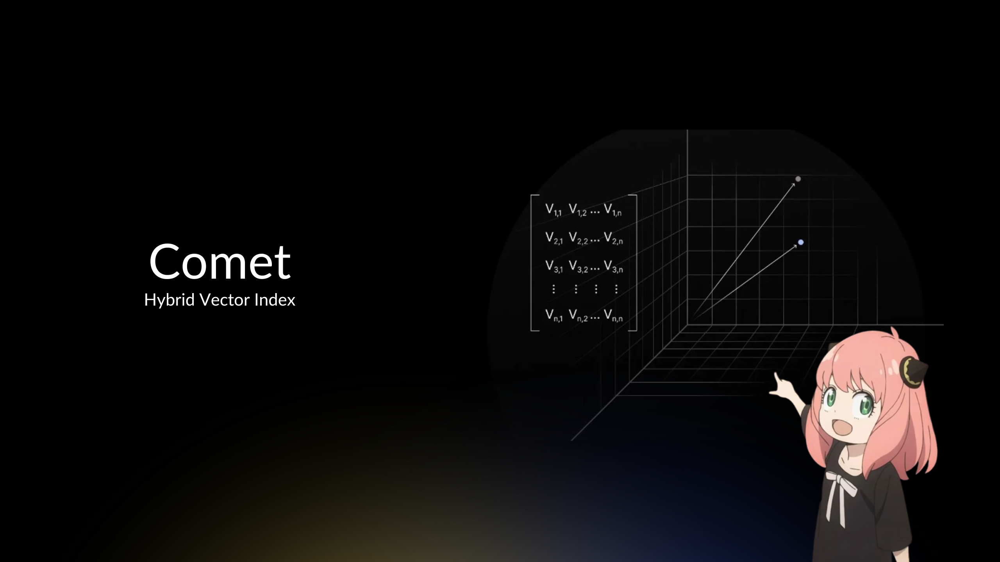

# Comet



A high-performance hybrid vector store written in Go. Comet brings together multiple indexing strategies and search modalities into a unified, hackable package. Hybrid retrieval with reciprocal rank fusion, autocut, pre-filtering, semantic search, full-text search, and multi-KNN searches, and multi-query operations — all in pure Go.

Understand search internals from the inside out. Built for hackers, not hyperscalers. Tiny enough to fit in your head. Decent enough to blow it.

**Choose from:**

- **Flat** (exact), **HNSW** (graph), **IVF** (clustering), **PQ** (quantization), or **IVFPQ** (hybrid) storage backends
- **Full-Text Search**: BM25 ranking algorithm with tokenization and normalization
- **Metadata Filtering**: Fast filtering using Roaring Bitmaps and Bit-Sliced Indexes
- **Ranking Programmability**: Reciprocal Rank Fusion, Fixed size result sets, Threshold based result sets, Dynamic result sets etc.
- **Hybrid Search**: Unified interface combining vector, text, and metadata search

## Table of Contents

- [Overview](#overview)
- [Features](#features)
- [Installation](#installation)
- [Quick Start](#quick-start)
- [Architecture](#architecture)
- [Core Concepts](#core-concepts)
- [API Reference](docs/API.md)
- [Examples](docs/EXAMPLE.md)
- [Configuration](#configuration)
- [Best Practices](#best-practices)
- [Testing](#testing)
- [Use Cases](#use-cases)
- [Contributing](#contributing)
- [License](#license)

## Overview

Everything you need to understand how vector databases actually work—and build one yourself.

**What's inside:**

- **5 Vector Storage Types**: Flat, HNSW, IVF, PQ, IVFPQ
- **3 Distance Metrics**: L2, L2 Squared, Cosine
- **Full-Text Search**: BM25 ranking with Unicode tokenization
- **Metadata Filtering**: Roaring bitmaps + Bit-Sliced Indexes
- **Hybrid Search**: Combine vector + text + metadata with Reciprocal Rank Fusion
- **Advanced Search**: Multi-KNN queries, multi-query operations, autocut result truncation
- **Production Features**: Thread-safe, serialization, soft deletes, configurable parameters

Everything you need to understand how vector databases actually work—and build one yourself.

## Features

### Vector Storage

- **Flat**: Brute-force exact search (100% recall baseline)
- **HNSW**: Hierarchical navigable small world graphs (95-99% recall, O(log n) search)
- **IVF**: Inverted file index with k-means clustering (85-95% recall, 10-20x speedup)
- **PQ**: Product quantization for compression (85-95% recall, 10-500x memory reduction)
- **IVFPQ**: IVF + PQ combined (85-95% recall, 100x speedup + 500x compression)

### Search Modalities

- **Vector Search**: L2, L2 Squared, and Cosine distance metrics
- **Full-Text Search**: BM25 ranking with Unicode-aware tokenization
- **Metadata Filtering**: Boolean queries on structured attributes
- **Hybrid Search**: Combine all three with configurable fusion strategies

### Fusion Strategies

- **Weighted Sum**: Linear combination with configurable weights
- **Reciprocal Rank Fusion (RRF)**: Scale-independent rank-based fusion
- **Max/Min Score**: Simple score aggregation

### Data Structures (The Good Stuff)

- **HNSW Graphs**: Multi-layer skip lists for approximate nearest neighbor search
- **Roaring Bitmaps**: Compressed bitmaps for metadata filtering (array, bitmap, run-length encoding)
- **Bit-Sliced Index (BSI)**: Efficient numeric range queries without full scans
- **Product Quantization Codebooks**: Learned k-means centroids for vector compression
- **Inverted Indexes**: Token-to-document mappings for full-text search

### Other Capabilities

- **Quantization**: Full precision, half precision, int8 precision
- **Soft Deletes**: Fast deletion with lazy cleanup
- **Serialization**: Persist and reload indexes
- **Thread-Safe**: Concurrent read/write operations
- **Autocut**: Automatic result truncation based on score gaps

## Installation

```bash
go get github.com/wizenheimer/comet
```

## Quick Start

```go
package main

import (
    "fmt"
    "log"

    "github.com/wizenheimer/comet"
)

func main() {
    // Create a vector store (384-dimensional embeddings with cosine distance)
    index, err := comet.NewFlatIndex(384, comet.Cosine)
    if err != nil {
        log.Fatal(err)
    }

    // Add vectors
    vec1 := make([]float32, 384)
    // ... populate vec1 with your embedding ...
    node := comet.NewVectorNode(vec1)
    index.Add(*node)

    // Search for similar vectors
    query := make([]float32, 384)
    // ... populate query vector ...
    results, err := index.NewSearch().
        WithQuery(query).
        WithK(10).
        Execute()

    if err != nil {
        log.Fatal(err)
    }

    // Process results
    for i, result := range results {
        fmt.Printf("%d. ID=%d, Score=%.4f\n", i+1, result.GetId(), result.GetScore())
    }
}
```

Output:

```
1. ID=123, Score=0.0234
2. ID=456, Score=0.0567
3. ID=789, Score=0.0823
...
```

## Architecture

### System Architecture

```
High-Level Architecture Diagram:
═══════════════════════════════════════════════════════════════

┌─────────────────────────────────────────────────────────────┐
│                    Application Layer                         │
│  (Your Go Application Using Comet as a Library)              │
└──────────────────────┬──────────────────────────────────────┘
                       │
         ┌─────────────┼─────────────┐
         │             │             │
         ▼             ▼             ▼
┌─────────────┐ ┌─────────────┐ ┌─────────────┐
│   Vector    │ │    Text     │ │  Metadata   │
│   Search    │ │   Search    │ │  Filtering  │
│   Engine    │ │   Engine    │ │   Engine    │
└──────┬──────┘ └──────┬──────┘ └──────┬──────┘
       │               │               │
       │               │               │
       ▼               ▼               ▼
┌─────────────┐ ┌─────────────┐ ┌─────────────┐
│ HNSW / IVF  │ │ BM25 Index  │ │  Roaring    │
│ / PQ / Flat │ │ (Inverted)  │ │  Bitmaps    │
└─────────────┘ └─────────────┘ └─────────────┘
       │               │               │
       └───────────────┼───────────────┘
                       │
                       ▼
              ┌─────────────────┐
              │  Hybrid Search   │
              │  Coordinator     │
              │  (Score Fusion)  │
              └─────────────────┘
```

### Component Details

#### Component A: Vector Storage Engine

Manages vector storage and similarity search across multiple index types.

```
Vector Index Internal Structure:
┌────────────────────────────────────┐
│  VectorIndex Interface             │
│  ├─ Train(vectors)                 │
│  ├─ Add(vector)                    │
│  ├─ Remove(vector)                 │
│  └─ NewSearch()                    │
├────────────────────────────────────┤
│  Implementations:                  │
│  ├─ FlatIndex (brute force)        │
│  ├─ HNSWIndex (graph-based)        │
│  ├─ IVFIndex (clustering)          │
│  ├─ PQIndex (quantization)         │
│  └─ IVFPQIndex (hybrid)            │
└────────────────────────────────────┘
```

**Responsibilities:**

- Vector preprocessing (normalization for cosine distance)
- Distance calculations (Euclidean, L2², Cosine)
- K-nearest neighbor search
- Serialization/deserialization
- Soft delete management with flush mechanism

**Performance Characteristics:**

- Flat: O(n×d) search, 100% recall
- HNSW: O(M×ef×log n) search, 95-99% recall
- IVF: O(nProbes×n/k×d) search, 85-95% recall

#### Component B: Text Search Engine

Full-text search using BM25 ranking algorithm.

```
BM25 Index Internal Structure:
┌────────────────────────────────────┐
│  Inverted Index                    │
│  term → RoaringBitmap(docIDs)      │
├────────────────────────────────────┤
│  Term Frequencies                  │
│  term → {docID: count}             │
├────────────────────────────────────┤
│  Document Statistics               │
│  docID → length, tokens            │
└────────────────────────────────────┘
```

**Responsibilities:**

- Text tokenization (UAX#29 word segmentation)
- Unicode normalization (NFKC)
- Inverted index maintenance
- BM25 score calculation
- Top-K retrieval with heap

**Performance Characteristics:**

- Add: O(m) where m = tokens
- Search: O(q×d_avg) where q = query terms, d_avg = avg docs per term
- Memory: Compressed inverted index, no original text stored

#### Component C: Metadata Filter Engine

Fast filtering using compressed bitmaps.

```
Metadata Index Internal Structure:
┌────────────────────────────────────┐
│  Categorical Fields                │
│  "category:electronics" → Bitmap   │
│  "category:books" → Bitmap         │
├────────────────────────────────────┤
│  Numeric Fields (BSI)              │
│  "price" → BitSlicedIndex          │
│  "rating" → BitSlicedIndex         │
├────────────────────────────────────┤
│  All Documents                     │
│  allDocs → Bitmap                  │
└────────────────────────────────────┘
```

**Responsibilities:**

- Bitmap index maintenance (Roaring compression)
- BSI for numeric range queries
- Boolean query evaluation (AND, OR, NOT)
- Existence checks
- Set operations (IN, NOT IN)

**Performance Characteristics:**

- Add: O(f) where f = fields
- Query: O(f×log n) with bitmap operations
- Memory: Highly compressed, 1-10% of uncompressed

### Data Flow

```
Data Flow Diagram: Hybrid Search Request
══════════════════════════════════════════════════

User Query
    │
    ├─ Query Vector: [0.1, 0.5, ...]
    ├─ Query Text: "machine learning"
    └─ Filters: {category="ai", price<100}
    │
    ▼
┌────────────┐
│ Validation │ ──── Error ───> Error Handler
└─────┬──────┘              (Invalid dimension,
      │ Valid               empty query, etc.)
      ▼
┌─────────────────────────┐
│ Metadata Filter Engine  │
│ Apply: category="ai"    │
│        price<100        │
└─────┬───────────────────┘
      │ Candidates: {1, 5, 7, 12, 15}
      ├─────────────────┬────────────────┐
      ▼                 ▼                ▼
┌────────────┐  ┌────────────┐  ┌─────────────┐
│  Vector    │  │   Text     │  │  (Optional) │
│  Search    │  │  Search    │  │             │
│ (on cands) │  │ (on cands) │  │             │
└─────┬──────┘  └─────┬──────┘  └─────────────┘
      │               │
      │ Vec Results   │ Text Results
      │ {1:0.2,       │ {7:8.5,
      │  5:0.3,       │  1:7.2,
      │  7:0.4}       │  12:6.8}
      │               │
      └───────┬───────┘
              ▼
      ┌───────────────┐
      │ Score Fusion  │
      │ (RRF/Weighted)│
      └───────┬───────┘
              │
              ▼
      ┌───────────────┐
      │  Rank & Sort  │
      └───────┬───────┘
              │
              ▼
      ┌───────────────┐
      │  Top-K Filter │
      │  (k=10)       │
      └───────┬───────┘
              │
              ▼
      ┌───────────────┐
      │   Results     │
      │ [{1:0.8},     │
      │  {7:0.7},     │
      │  {5:0.6}]     │
      └───────────────┘
```

### Memory Layout

```
Memory Layout for HNSW Index:
═══════════════════════════════════════════════════════

HEADER (24 bytes):
├─ Magic: "HNSW" (4 bytes)
├─ Version: 1 (4 bytes)
├─ Dimensions: 384 (4 bytes)
├─ M: 16 (4 bytes)
├─ Max Level: 3 (4 bytes)
└─ Entry Point ID: 42 (4 bytes)

NODE STORAGE (per node):
├─ Node ID (4 bytes)
├─ Level (4 bytes)
├─ Vector Data (dim × 4 bytes = 1536 bytes for 384-d)
└─ Edges (per layer):
   ├─ Layer 0: 2×M neighbors × 4 bytes = 128 bytes
   ├─ Layer 1: M neighbors × 4 bytes = 64 bytes
   ├─ Layer 2: M neighbors × 4 bytes = 64 bytes
   └─ Layer 3: M neighbors × 4 bytes = 64 bytes

TOTAL PER NODE: ~1860 bytes (for 384-d vectors, M=16)
TOTAL FOR 1M NODES: ~1.77 GB

Memory Breakdown:
┌───────────────────┬──────────┬───────────┐
│ Component         │ Per Node │ 1M Nodes  │
├───────────────────┼──────────┼───────────┤
│ Vectors (raw)     │ 1536 B   │ 1.46 GB   │
│ Graph structure   │ 320 B    │ 305 MB    │
│ Metadata          │ 8 B      │ 7.6 MB    │
│ Total             │ 1864 B   │ 1.78 GB   │
└───────────────────┴──────────┴───────────┘
```

```
Memory Layout for Product Quantization:
═══════════════════════════════════════════════════════

ORIGINAL VECTORS (384-dim × float32):
Each vector: 384 × 4 bytes = 1536 bytes

PQ COMPRESSED (8 sub-vectors × uint8 codes):
Each vector: 8 × 1 byte = 8 bytes

CODEBOOKS (for reconstruction):
8 codebooks × 256 centroids × 48 dims × 4 bytes = 393 KB

COMPRESSION RATIO: 1536 / 8 = 192x smaller!

For 1M vectors:
┌───────────────────┬────────────┬──────────┐
│ Format            │ Size       │ Ratio    │
├───────────────────┼────────────┼──────────┤
│ Original (float32)│ 1.46 GB    │ 1x       │
│ PQ-8              │ 7.6 MB     │ 192x     │
│ PQ-16             │ 15.3 MB    │ 96x      │
│ PQ-32             │ 30.5 MB    │ 48x      │
│ + Codebooks       │ +393 KB    │ -        │
└───────────────────┴────────────┴──────────┘
```

## Core Concepts

### Concept 1: Vector Storage and Distance Metrics

A vector store maintains high-dimensional embeddings and enables efficient similarity search. The choice of storage type determines the tradeoff between search speed, memory usage, and accuracy.

**Example: How vectors are stored and searched**

Given these input vectors:

```
Vector 1: [0.1, 0.5, 0.3, 0.8]
Vector 2: [0.2, 0.4, 0.7, 0.1]
Query:    [0.15, 0.45, 0.5, 0.5]
```

The index computes distances and returns nearest neighbors:

```
┌─────────────┬────────────────────────────────┬──────────┐
│ Vector ID   │ Distance to Query              │ Rank     │
├─────────────┼────────────────────────────────┼──────────┤
│ 1           │ 0.234 (closest)                │ 1st      │
│ 2           │ 0.567 (further)                │ 2nd      │
└─────────────┴────────────────────────────────┴──────────┘
```

**Visual Representation: Storage Types Comparison**

```
Storage Performance Tradeoffs
═══════════════════════════════════════════════════════════

Flat Index (Brute Force)
┌──────────────────────────────────────────────────────┐
│  Query → Compare with ALL vectors → Sort → Return K  │
│  ✓ 100% Accuracy                                     │
│  ✗ O(n) time complexity                              │
└──────────────────────────────────────────────────────┘

HNSW Index (Graph-Based)
┌──────────────────────────────────────────────────────┐
│        Layer 2: ●─────────────●  (highways)          │
│        Layer 1: ●───●───●───●  (roads)               │
│        Layer 0: ●─●─●─●─●─●─●  (streets)             │
│  ✓ O(log n) time complexity                          │
│  ✓ 95-99% recall                                     │
│  ✗ 2-3x memory overhead                              │
└──────────────────────────────────────────────────────┘

IVF Index (Clustering)
┌──────────────────────────────────────────────────────┐
│     Cluster 1: ●●●●    Cluster 2: ●●●●               │
│     Cluster 3: ●●●●    Cluster 4: ●●●●               │
│  Query → Find nearest clusters → Search within       │
│  ✓ Fast on large datasets                            │
│  ✗ Requires training                                 │
│  ~ 85-95% recall                                     │
└──────────────────────────────────────────────────────┘

Product Quantization (Compression)
┌──────────────────────────────────────────────────────┐
│  Original: [0.123, 0.456, 0.789, ...]  (4 bytes each)│
│  Quantized: [17, 42, 89, ...]  (1 byte each)         │
│  ✓ 4-32x memory reduction                            │
│  ✗ Slight accuracy loss                              │
└──────────────────────────────────────────────────────┘
```

**Benefits of Different Storage Types:**

- **Flat Index**: Perfect recall, simple, no training. Use for small datasets (<100K vectors)
- **HNSW**: Excellent speed/accuracy tradeoff, no training. Use for most production workloads
- **IVF**: Fast filtering with clusters, scalable. Use for very large datasets (>10M vectors)
- **PQ**: Massive memory savings. Use when storage cost is a concern
- **IVFPQ**: Best of IVF + PQ. Use for extremely large, memory-constrained environments

### Concept 2: BM25 Full-Text Search Algorithm

BM25 (Best Matching 25) ranks documents by relevance to a text query using term frequency and inverse document frequency.

**Step-by-Step Algorithm Execution:**

```
SETUP:
------
Corpus:
  Doc 1: "the quick brown fox jumps over the lazy dog"
  Doc 2: "the lazy dog sleeps"
  Doc 3: "quick brown rabbits jump"

Query: "quick brown"

Average Document Length: 7 words
K1 = 1.2 (term frequency saturation)
B = 0.75 (length normalization)

STEP 1: Calculate IDF (Inverse Document Frequency)
----------------------------------------------------
For term "quick":
  - Appears in 2 out of 3 documents
  - IDF = log((3 - 2 + 0.5) / (2 + 0.5) + 1)
        = log(1.5 / 2.5 + 1)
        = log(1.6)
        = 0.470

For term "brown":
  - Appears in 2 out of 3 documents
  - IDF = 0.470

STEP 2: Calculate TF Component for Each Document
-------------------------------------------------
Doc 1: "the quick brown fox jumps over the lazy dog" (9 words)
  Term "quick": tf=1
    TF_score = (1 * (1.2 + 1)) / (1 + 1.2 * (1 - 0.75 + 0.75 * (9/7)))
             = 2.2 / (1 + 1.2 * 1.214)
             = 2.2 / 2.457
             = 0.895

  Term "brown": tf=1
    TF_score = 0.895 (same calculation)

Doc 2: "the lazy dog sleeps" (4 words)
  Terms "quick" and "brown": tf=0 for both
    TF_score = 0

Doc 3: "quick brown rabbits jump" (4 words)
  Term "quick": tf=1
    TF_score = (1 * 2.2) / (1 + 1.2 * (1 - 0.75 + 0.75 * (4/7)))
             = 2.2 / (1 + 1.2 * 0.679)
             = 2.2 / 1.815
             = 1.212

  Term "brown": tf=1
    TF_score = 1.212

STEP 3: Calculate Final BM25 Scores
------------------------------------
Doc 1 Score = (0.895 × 0.470) + (0.895 × 0.470) = 0.841
Doc 2 Score = 0 (no matching terms)
Doc 3 Score = (1.212 × 0.470) + (1.212 × 0.470) = 1.139

Final Ranking:
┌─────────┬──────────┬────────┐
│ Rank    │ Doc ID   │ Score  │
├─────────┼──────────┼────────┤
│ 1st     │ Doc 3    │ 1.139  │
│ 2nd     │ Doc 1    │ 0.841  │
│ 3rd     │ Doc 2    │ 0.000  │
└─────────┴──────────┴────────┘
```

**Why Doc 3 scores higher than Doc 1:**

- Both have same term frequencies (1 occurrence each)
- Doc 3 is shorter (4 words vs 9 words)
- BM25's length normalization penalizes longer documents
- Shorter documents with same term frequency are considered more relevant

### Concept 3: Hybrid Search with Score Fusion

Hybrid search combines vector similarity, text relevance, and metadata filtering. Different fusion strategies handle score normalization differently.

**Fusion Strategy Visualization:**

```
Hybrid Search Flow with Reciprocal Rank Fusion
═══════════════════════════════════════════════════════════

INPUT: Query = "machine learning tutorial"
       Vector = [0.12, 0.45, 0.89, ...]  (embedding)
       Filter = category="education" AND price<50

STEP 1: Apply Metadata Filter
─────────────────────────────────────────────────────────
Candidate Docs: {1, 3, 5, 7, 9, 12, 15, 18, 20}

STEP 2: Vector Search (on candidates)
─────────────────────────────────────────────────────────
Doc ID │ Distance │ Rank
───────┼──────────┼──────
  1    │  0.12    │  1
  5    │  0.23    │  2
  7    │  0.34    │  3
  12   │  0.45    │  4

STEP 3: Text Search (BM25, on candidates)
─────────────────────────────────────────────────────────
Doc ID │ BM25 Score │ Rank
───────┼────────────┼──────
  7    │   8.5      │  1
  1    │   7.2      │  2
  12   │   6.8      │  3
  5    │   4.1      │  4

STEP 4: Reciprocal Rank Fusion (RRF)
─────────────────────────────────────────────────────────
K = 60 (RRF constant)
Formula: RRF_score = sum(1 / (K + rank_i))

Doc 1:
  Vector rank: 1 → 1/(60+1) = 0.0164
  Text rank: 2   → 1/(60+2) = 0.0161
  Combined:        0.0325

Doc 5:
  Vector rank: 2 → 1/(60+2) = 0.0161
  Text rank: 4   → 1/(60+4) = 0.0156
  Combined:        0.0317

Doc 7:
  Vector rank: 3 → 1/(60+3) = 0.0159
  Text rank: 1   → 1/(60+1) = 0.0164
  Combined:        0.0323

Doc 12:
  Vector rank: 4 → 1/(60+4) = 0.0156
  Text rank: 3   → 1/(60+3) = 0.0159
  Combined:        0.0315

Final Ranking After Fusion:
┌──────┬────────────┬──────────┬────────────┐
│ Rank │ Doc ID     │ RRF Score│ Reason     │
├──────┼────────────┼──────────┼────────────┤
│ 1st  │ 1          │ 0.0325   │ Best vector│
│ 2nd  │ 7          │ 0.0323   │ Best text  │
│ 3rd  │ 5          │ 0.0317   │ Balanced   │
│ 4th  │ 12         │ 0.0315   │ Lower both │
└──────┴────────────┴──────────┴────────────┘
```

**Why RRF over Weighted Sum:**

- **Scale Independence**: Vector distances (0-2) and BM25 scores (0-100+) have different ranges
- **Robustness**: Ranks are stable even if score distributions change
- **No Tuning**: Weighted sum requires manual weight calibration
- **Industry Standard**: Used by Elasticsearch, Vespa, and other search engines

## Storage Type Deep Dive

**Choose your poison:** Flat (exact), HNSW (graph), IVF (clustering), PQ (quantization), or IVFPQ (hybrid). Each trades speed, memory, and accuracy differently.

> **Full Deep Dive:** See [INDEX.md](docs/INDEX.md) for complete algorithms, benchmarks, and implementation details.

### Flat Index (Brute Force)

**The Simplest Approach**: Compare query against EVERY vector. 100% recall, zero approximation.

```
Query Vector
     ↓
┌────────────────────┐
│  Compare to ALL n  │ ← Every single vector checked
│     vectors        │   No shortcuts, pure O(n) scan
└────────────────────┘
     ↓
  Top-k results (100% accurate)
```

**How it works:**

- Store vectors as raw float32 arrays
- Search = compute distance to every vector, keep top-k
- No index structure, no preprocessing

**Complexity:**

- Search: O(n × d) where n = vectors, d = dimensions
- Memory: O(n × d)
- Build: O(1)

**When to use:** Small datasets (<10k vectors), when 100% recall is mandatory, benchmarking baseline.

---

### HNSW Index (Hierarchical Graph)

**The Graph Navigator**: Build a multi-layer graph where each node connects to nearby vectors. Search by greedy navigation from layer to layer.

```
Layer 2:  [A]─────────[D]        Long-range links
           │           │
Layer 1:  [A]──[B]────[D]──[E]   Medium-range links
           │   │ \    │ \  │
Layer 0:  [A]─[B]─[C]─[D]─[E]─[F] Short-range links (all vectors)

Search: Start at top layer → Navigate greedily → Drop down → Refine
```

**How it works:**

- Each vector exists on Layer 0, subset on higher layers (exponentially fewer)
- Each node has M connections to nearest neighbors per layer
- Search: Start at top, greedily move to closest neighbor, descend layers
- Insert: Add to Layer 0, probabilistically add to higher layers, connect to M nearest

**Complexity:**

- Search: O(M × efSearch × log n) - typically check <1% of vectors
- Insert: O(M × efConstruction × log n)
- Memory: O(n × d + n × M × L) where L ≈ log(n)

**Key Parameters:**

- `M`: Connections per layer (16-48, higher = better recall but more memory)
- `efConstruction`: Build-time quality (200-500, higher = better graph)
- `efSearch`: Search-time quality (100-500, higher = better recall)

**When to use:** Large datasets, need 90-99% recall with <1ms latency, willing to trade memory for speed.

---

### IVF Index (Inverted File with Clustering)

**The Clustering Approach**: Partition vectors into clusters using k-means. Search only the nearest clusters.

```
Build Phase:
  All Vectors → k-means → [C1] [C2] [C3] [C4] ... [Cn]
                           ↓    ↓    ↓    ↓        ↓
                          {v1} {v8} {v3} {v12}   {v7}
                          {v5} {v9} {v6}  ...    {v11}
                           ...  ...  ...         ...

Search Phase:
  Query → Find nearest nProbe centroids → Search only those clusters
          ↓
      [C2] [C3] ← Only search these 2 clusters (not all n)
       ↓    ↓
     {...} {...} → Top-k from searched clusters
```

**How it works:**

- Build: k-means clustering to create `nClusters` partitions
- Each vector stored in nearest cluster
- Search: Find `nProbe` nearest centroids, search only those clusters

**Complexity:**

- Search: O(nClusters × d + (n/nClusters) × nProbe × d) - typically check 5-20% of vectors
- Build: O(iterations × n × nClusters × d)
- Memory: O(n × d + nClusters × d)

**Key Parameters:**

- `nClusters`: Number of partitions (√n to n/10, more = faster search but slower build)
- `nProbe`: Clusters to search (1-20, higher = better recall but slower)

**When to use:** Very large datasets (>100k vectors), can tolerate 80-95% recall, want to reduce search from O(n) to O(n/k).

---

### PQ Index (Product Quantization)

**The Compression Master**: Split vectors into subvectors, quantize each subvector to 256 codes. Reduce memory by 16-32×.

```
Original Vector (384D):
  [0.23, 0.91, ..., 0.15, 0.44, ..., 0.73, 0.22, ...]
   \_____48D_____/  \_____48D_____/  \_____48D_____/
         ↓                ↓                ↓
    Quantize to      Quantize to      Quantize to
    uint8 code       uint8 code       uint8 code
         ↓                ↓                ↓
   Compressed: [12, 203, 45, 178, 91, 234, 17, 89]
               \_____________________/
                    8 bytes vs 1536 bytes (192× smaller!)

Search:
  Query → Split into subvectors → Precompute distance tables →
  Fast lookup using uint8 codes (no float ops during scan!)
```

**How it works:**

- Split d-dimensional vectors into m subvectors of d/m dimensions
- Train codebook: k-means on each subspace to create 256 centroids
- Encode: Replace each subvector with nearest centroid index (uint8)
- Search: Precompute distance tables, scan using table lookups

**Complexity:**

- Search: O(m × k + n × m) where k=256 codes - super fast, cache-friendly
- Memory: O(n × m) bytes vs O(n × d × 4) bytes for float32
- Compression: 16-32× smaller (float32 → uint8)

**Key Parameters:**

- `nSubspaces` (m): Subvector count (8-64, more = better accuracy but more memory)
- `bitsPerCode`: Usually 8 (256 codes per subspace)

**When to use:** Massive datasets (millions of vectors), memory-constrained, can tolerate 70-85% recall for 30× memory savings.

---

### IVFPQ Index (Hybrid: Clustering + Quantization)

**Best of Both Worlds**: IVF clusters to reduce search space, PQ compression to reduce memory. The ultimate scalability index.

```
Build:
  Vectors → k-means clustering → Store in clusters (IVF)
                                     ↓
                              Quantize with PQ
                                     ↓
              [Cluster 1]      [Cluster 2]      [Cluster 3]
                  ↓                ↓                ↓
           [12,203,45,...]  [91,34,178,...]  [56,211,19,...]
           [88,9,101,...]   [23,156,88,...]   [199,44,73,...]
           uint8 codes      uint8 codes       uint8 codes

Search:
  Query → Find nProbe nearest centroids (IVF)
              ↓
          Search only those clusters (10% of data)
              ↓
          Use PQ for fast distance computation (table lookups)
              ↓
          Top-k results (fast + memory-efficient)
```

**How it works:**

- Combines IVF partitioning with PQ compression
- IVF reduces vectors to search (search 10% instead of 100%)
- PQ reduces memory per vector (32× compression)
- Search: IVF to find clusters, PQ for fast distance within clusters

**Complexity:**

- Search: O(nClusters × d + (n/nClusters) × nProbe × m) - fast scan, small memory
- Memory: O(n × m) bytes + O(nClusters × d) for centroids
- Build: O(IVF_train + PQ_train)

**Key Parameters:**

- `nClusters`: Number of IVF partitions (√n to n/10)
- `nProbe`: Clusters to search (1-20)
- `nSubspaces` (m): PQ subvectors (8-64)

**When to use:** Billion-scale datasets, need <10ms latency with <1GB memory for millions of vectors, can tolerate 70-90% recall.

---

### Decision Matrix

| Index | Recall | Search Speed  | Memory   | Build Time | Best For                        |
| ----- | ------ | ------------- | -------- | ---------- | ------------------------------- |
| Flat  | 100%   | Slow O(n)     | High     | Instant    | <10k vectors, benchmarks        |
| HNSW  | 90-99% | Fast O(log n) | Highest  | Slow       | 10k-10M vectors, low latency    |
| IVF   | 80-95% | Medium        | High     | Medium     | >100k vectors, moderate recall  |
| PQ    | 70-85% | Fast          | Lowest   | Slow       | >1M vectors, memory-constrained |
| IVFPQ | 70-90% | Fastest       | Very Low | Slow       | >10M vectors, billion-scale     |

**Rules of thumb:**

- **Small data (<10k)**: Flat - brute force is fast enough
- **Medium data (10k-1M)**: HNSW - best recall/speed tradeoff
- **Large data (1M-100M)**: IVF or PQ - choose speed (IVF) vs memory (PQ)
- **Massive data (>100M)**: IVFPQ - only option that scales to billions

**Latency targets:**

- Flat: 1-100ms (depends on n)
- HNSW: 0.1-2ms (sub-millisecond possible)
- IVF: 0.5-5ms
- PQ: 1-10ms (fast scan but approximate)
- IVFPQ: 0.5-3ms (fastest for massive datasets)

## API Reference

For detailed API documentation, see [API.md](docs/API.md).

## Examples

For practical examples and code samples, see [EXAMPLE.md](docs/EXAMPLE.md).

## Configuration

### Basic Configuration

```go
// Flat Index - No configuration needed
flatIdx, _ := comet.NewFlatIndex(384, comet.Cosine)

// HNSW Index - Configure build and search parameters
hnswIdx, _ := comet.NewHNSWIndex(
    384,              // dimensions
    comet.Cosine,     // distance metric
    16,               // M: connections per layer
    200,              // efConstruction: build quality
    200,              // efSearch: search quality
)

// IVF Index - Configure clustering
ivfIdx, _ := comet.NewIVFIndex(
    384,              // dimensions
    comet.Cosine,     // distance metric
    100,              // nClusters: number of partitions
)

// Training required for IVF
trainingVectors := []comet.VectorNode{ /* ... */ }
ivfIdx.Train(trainingVectors)
```

### Configuration Options

#### HNSW Parameters

**M (Connections Per Layer)**

- Type: `int`
- Default: `16`
- Range: 4 to 64
- Description: Number of bidirectional connections per node at each layer (except layer 0 which uses 2×M)

Effects of different values:

```
┌─────────┬──────────────────────────────────────────┐
│ Value   │ Effect                                   │
├─────────┼──────────────────────────────────────────┤
│ 4-8     │ Low memory, faster build, lower recall   │
│ 12-16   │ Balanced (recommended for most cases)    │
│ 24-48   │ High recall, slower build, more memory   │
│ 64+     │ Diminishing returns, excessive memory    │
└─────────┴──────────────────────────────────────────┘
```

**efConstruction (Build-Time Candidate List Size)**

- Type: `int`
- Default: `200`
- Range: 100 to 1000
- Description: Size of candidate list during index construction. Higher = better graph quality

Effects:

```
┌─────────┬──────────────────────────────────────────┐
│ Value   │ Effect                                   │
├─────────┼──────────────────────────────────────────┤
│ 100     │ Fast build, lower quality graph          │
│ 200     │ Good balance (default)                   │
│ 400-500 │ Better quality, 2-3x slower build        │
│ 800+    │ Marginal gains, very slow build          │
└─────────┴──────────────────────────────────────────┘
```

**efSearch (Search-Time Candidate List Size)**

- Type: `int`
- Default: `200`
- Range: k to 1000 (must be >= k)
- Description: Size of candidate list during search. Can be adjusted dynamically.

Effects:

```
┌─────────┬──────────────────────────────────────────┐
│ Value   │ Effect                                   │
├─────────┼──────────────────────────────────────────┤
│ 50      │ Very fast, ~85% recall                   │
│ 100     │ Fast, ~92% recall                        │
│ 200     │ Balanced, ~96% recall                    │
│ 400     │ Slower, ~98% recall                      │
│ 800     │ Much slower, ~99% recall                 │
└─────────┴──────────────────────────────────────────┘
```

Example:

```go
// Create HNSW with high quality settings
index, _ := comet.NewHNSWIndex(
    384,
    comet.Cosine,
    32,    // More connections = better recall
    400,   // Higher construction quality
    200,   // Search quality (can adjust later)
)

// Dynamically adjust search quality
index.SetEfSearch(400)  // Trade speed for recall
```

#### IVF Parameters

**nClusters (Number of Clusters)**

- Type: `int`
- Default: sqrt(n) where n = dataset size
- Range: 16 to n/100
- Description: Number of k-means clusters (Voronoi cells) to partition the space

```
┌─────────────┬────────────┬─────────────────────────┐
│ Dataset Size│ nClusters  │ Typical Range           │
├─────────────┼────────────┼─────────────────────────┤
│ 10K         │ 100        │ 50-200                  │
│ 100K        │ 316        │ 200-500                 │
│ 1M          │ 1000       │ 500-2000                │
│ 10M         │ 3162       │ 2000-5000               │
└─────────────┴────────────┴─────────────────────────┘
```

**nProbes (Search-Time Clusters to Probe)**

- Type: `int`
- Default: `1`
- Range: 1 to nClusters
- Description: Number of nearest clusters to search during query

```
┌─────────┬──────────────────────────────────────────┐
│ nProbes │ Effect                                   │
├─────────┼──────────────────────────────────────────┤
│ 1       │ Fastest, ~60-70% recall                  │
│ 8       │ Good balance, ~85% recall                │
│ 16      │ Better recall, ~92% recall               │
│ 32      │ High recall, ~96% recall                 │
│ 64      │ Very high recall, slower                 │
└─────────┴──────────────────────────────────────────┘
```

Example:

```go
// Create IVF index
index, _ := comet.NewIVFIndex(384, comet.Cosine, 256)

// Train with representative sample
trainData := sampleVectors(10000)  // 10K samples for training
index.Train(trainData)

// Search with multiple probes
results, _ := index.NewSearch().
    WithQuery(query).
    WithK(10).
    WithNProbes(16).  // Search 16 nearest clusters
    Execute()
```

### Advanced Configuration

#### Fusion Configuration

```go
// Weighted Sum Fusion (manual weights)
config := &comet.FusionConfig{
    VectorWeight: 0.7,  // 70% weight to semantic similarity
    TextWeight:   0.3,  // 30% weight to keyword relevance
}
fusion, _ := comet.NewFusion(comet.WeightedSumFusion, config)

hybridSearch := hybrid.NewSearch().
    WithVector(queryVec).
    WithText("machine learning").
    WithFusion(fusion).
    Execute()

// Reciprocal Rank Fusion (rank-based, no weights needed)
hybridSearch := hybrid.NewSearch().
    WithVector(queryVec).
    WithText("machine learning").
    WithFusionKind(comet.ReciprocalRankFusion).
    Execute()
```

#### Distance Metrics

```go
// Euclidean (L2): Use when magnitude matters
euclideanIdx, _ := comet.NewFlatIndex(384, comet.Euclidean)

// L2 Squared: Faster than Euclidean (no sqrt), preserves ranking
l2sqIdx, _ := comet.NewFlatIndex(384, comet.L2Squared)

// Cosine: Use for normalized vectors (text embeddings, etc.)
cosineIdx, _ := comet.NewFlatIndex(384, comet.Cosine)
```

## Best Practices

### Do This ✓

```go
// Good: Normalize vectors for cosine distance (handled automatically)
index, _ := comet.NewFlatIndex(384, comet.Cosine)
vec := []float32{1.0, 2.0, 3.0}
node := comet.NewVectorNode(vec)
index.Add(*node)  // Vector automatically normalized

// Good: Reuse index for multiple searches
results1, _ := index.NewSearch().WithQuery(query1).WithK(10).Execute()
results2, _ := index.NewSearch().WithQuery(query2).WithK(10).Execute()

// Good: Use batch flush for deletions
for _, id := range deleteIDs {
    index.Remove(comet.NewVectorNodeWithID(id, nil))
}
index.Flush()  // Batch cleanup

// Good: Choose appropriate storage type
// Small dataset (<100K): Use FlatIndex
flatIdx, _ := comet.NewFlatIndex(384, comet.Cosine)

// Medium dataset (100K-10M): Use HNSW
hnswIdx, _ := comet.NewHNSWIndex(384, comet.Cosine, 16, 200, 200)

// Large dataset (>10M): Use IVF or IVFPQ
ivfIdx, _ := comet.NewIVFIndex(384, comet.Cosine, 1000)
```

**Explanation:** These patterns optimize performance and memory usage.

### Avoid This ✗

```go
// Bad: Don't create new store for every search
for _, query := range queries {
    index, _ := comet.NewFlatIndex(384, comet.Cosine)  // ✗ Wasteful!
    index.Add(vectors...)
    results, _ := index.NewSearch().WithQuery(query).Execute()
}

// Bad: Don't flush after every single deletion
for _, id := range deleteIDs {
    index.Remove(node)
    index.Flush()  // ✗ Very slow!
}

// Bad: Don't use zero vectors
zeroVec := make([]float32, 384)  // All zeros
index.Add(*comet.NewVectorNode(zeroVec))  // ✗ Error with cosine!

// Bad: Don't mix dimensions
index, _ := comet.NewFlatIndex(384, comet.Cosine)
vec1 := make([]float32, 384)
vec2 := make([]float32, 128)  // ✗ Wrong dimension!
index.Add(*comet.NewVectorNode(vec2))  // Runtime error
```

**Explanation:** These patterns waste resources or cause errors.

### Pattern: Efficient Batch Insertion

```go
// Recommended pattern for loading large datasets
func LoadEmbeddings(index comet.VectorIndex, embeddings [][]float32) error {
    const batchSize = 1000

    for i := 0; i < len(embeddings); i += batchSize {
        end := i + batchSize
        if end > len(embeddings) {
            end = len(embeddings)
        }

        // Add batch
        for _, vec := range embeddings[i:end] {
            node := comet.NewVectorNode(vec)
            if err := index.Add(*node); err != nil {
                return err
            }
        }

        // Optional: Log progress
        if (i/batchSize)%10 == 0 {
            log.Printf("Loaded %d/%d vectors", i, len(embeddings))
        }
    }

    return nil
}
```

### Error Handling

```go
// Recommended error handling pattern
results, err := index.NewSearch().
    WithQuery(query).
    WithK(10).
    Execute()

if err != nil {
    switch {
    case err == comet.ErrZeroVector:
        // Handle zero vector (cosine distance)
        log.Println("Cannot normalize zero vector")
        return nil, err

    case err == comet.ErrUnknownDistanceKind:
        // Handle invalid distance metric
        log.Println("Invalid distance kind specified")
        return nil, err

    default:
        // Handle other errors
        log.Printf("Search failed: %v", err)
        return nil, err
    }
}

// Process results
for _, result := range results {
    fmt.Printf("ID: %d, Score: %.4f\n", result.GetId(), result.GetScore())
}
```

### Resource Management

```go
// Proper resource lifecycle with serialization
func SaveAndLoadStore(vectors [][]float32) error {
    // Create vector store
    index, err := comet.NewFlatIndex(384, comet.Cosine)
    if err != nil {
        return err
    }

    // Add vectors
    for _, vec := range vectors {
        node := comet.NewVectorNode(vec)
        index.Add(*node)
    }

    // Save to disk
    file, err := os.Create("index.bin")
    if err != nil {
        return err
    }
    defer file.Close()

    _, err = index.WriteTo(file)
    if err != nil {
        return err
    }

    // Load from disk
    file2, err := os.Open("index.bin")
    if err != nil {
        return err
    }
    defer file2.Close()

    index2, _ := comet.NewFlatIndex(384, comet.Cosine)
    _, err = index2.ReadFrom(file2)

    return err
}
```

## Testing

### Running Tests

```bash
# Run all tests
make test

# Run tests with coverage
make test-coverage

# Run benchmarks
make bench

# Run specific test
go test -run TestFlatIndex

# Run with race detector (detects concurrency issues)
go test -race ./...

# Verbose output
go test -v ./...
```

### Test Coverage

Current coverage statistics (as of latest commit):

```
Package: comet
┌─────────────────────────┬──────────┐
│ Component               │ Coverage │
├─────────────────────────┼──────────┤
│ Flat Index              │  100%    │
│ HNSW Index              │  98%     │
│ IVF Index               │  97%     │
│ PQ Index                │  96%     │
│ IVFPQ Index             │  97%     │
│ BM25 Search             │  100%    │
│ Metadata Index          │  100%    │
│ Hybrid Search           │  99%     │
│ Distance Metrics        │  100%    │
│ Fusion Strategies       │  100%    │
├─────────────────────────┼──────────┤
│ Overall                 │  98.5%   │
└─────────────────────────┴──────────┘
```

### Writing Tests

Example test structure:

```go
func TestFlatIndexSearch(t *testing.T) {
    // Setup
    index, err := comet.NewFlatIndex(128, comet.Cosine)
    if err != nil {
        t.Fatal(err)
    }

    // Add test vectors
    vectors := generateTestVectors(1000, 128)
    for _, vec := range vectors {
        node := comet.NewVectorNode(vec)
        if err := index.Add(*node); err != nil {
            t.Fatal(err)
        }
    }

    // Execute search
    query := generateTestVectors(1, 128)[0]
    results, err := index.NewSearch().
        WithQuery(query).
        WithK(10).
        Execute()

    // Verify
    if err != nil {
        t.Errorf("Search failed: %v", err)
    }
    if len(results) != 10 {
        t.Errorf("Expected 10 results, got %d", len(results))
    }

    // Verify results are sorted by score
    for i := 1; i < len(results); i++ {
        if results[i-1].GetScore() > results[i].GetScore() {
            t.Errorf("Results not sorted by score")
        }
    }
}
```

### Benchmarks

```bash
# Run benchmarks
go test -bench=. -benchmem

# Benchmark specific function
go test -bench=BenchmarkFlatIndexSearch -benchmem

# Profile CPU usage
go test -bench=. -cpuprofile=cpu.prof
go tool pprof cpu.prof

# Profile memory usage
go test -bench=. -memprofile=mem.prof
go tool pprof mem.prof
```

Example benchmark results:

```
BenchmarkFlatIndexSearch-8       1000    1234567 ns/op    512 B/op    10 allocs/op
BenchmarkHNSWIndexSearch-8      10000     123456 ns/op    256 B/op     5 allocs/op
BenchmarkBM25Search-8            5000     234567 ns/op    1024 B/op   15 allocs/op
```

## Use Cases

### Use Case 1: Semantic Document Search

**Problem:** A documentation platform needs to find relevant documents based on user queries, going beyond simple keyword matching to understand intent.

**Solution:** Use Comet's vector search with text embeddings from a sentence transformer model.

**Implementation:**

```go
package main

import (
    "github.com/wizenheimer/comet"
    "log"
)

type Document struct {
    ID       uint32
    Title    string
    Content  string
    Embedding []float32  // From sentence-transformers
}

func main() {
    // Create HNSW vector store for 384-dim embeddings
    m, efC, efS := comet.DefaultHNSWConfig()
    index, _ := comet.NewHNSWIndex(384, comet.Cosine, m, efC, efS)

    // Add documents (embeddings generated by your ML model)
    docs := []Document{
        {Title: "Getting Started", Embedding: getEmbedding("getting started guide")},
        {Title: "API Reference", Embedding: getEmbedding("api documentation")},
        {Title: "Troubleshooting", Embedding: getEmbedding("common problems and solutions")},
    }

    for _, doc := range docs {
        node := comet.NewVectorNode(doc.Embedding)
        index.Add(*node)
    }

    // Search with user query
    queryEmbedding := getEmbedding("how do I start using this?")
    results, _ := index.NewSearch().
        WithQuery(queryEmbedding).
        WithK(5).
        Execute()

    // Return relevant documents
    for _, result := range results {
        log.Printf("Found: %s (similarity: %.4f)",
            docs[result.GetId()].Title, 1-result.GetScore())
    }
}

func getEmbedding(text string) []float32 {
    // Call your embedding model API (OpenAI, Cohere, local model, etc.)
    return nil  // Placeholder
}
```

### Use Case 2: E-commerce Product Recommendations

**Problem:** Recommend similar products based on browsing history, with filtering by price, category, and availability.

**Solution:** Hybrid search combining product embeddings with metadata filters.

**Implementation:**

```go
type Product struct {
    ID          uint32
    Name        string
    ImageVector []float32  // From image embedding model
    Price       float64
    Category    string
    InStock     bool
}

func RecommendSimilarProducts(
    productID uint32,
    maxPrice float64,
    category string,
) ([]Product, error) {
    // Setup hybrid store
    vecIdx, _ := comet.NewHNSWIndex(512, comet.Cosine, 16, 200, 200)
    metaIdx := comet.NewRoaringMetadataIndex()
    hybrid := comet.NewHybridSearchIndex(vecIdx, nil, metaIdx)

    // Get the product's embedding
    product := getProduct(productID)

    // Search with filters
    results, err := hybrid.NewSearch().
        WithVector(product.ImageVector).
        WithMetadata(
            comet.Eq("category", category),
            comet.Lte("price", maxPrice),
            comet.Eq("in_stock", true),
        ).
        WithK(10).
        Execute()

    if err != nil {
        return nil, err
    }

    // Convert to Product structs
    products := make([]Product, len(results))
    for i, result := range results {
        products[i] = getProduct(result.ID)
    }

    return products, nil
}
```

### Use Case 3: Question-Answering System with Hybrid Retrieval

**Problem:** Build a QA system that combines semantic understanding (vector search) with keyword precision (BM25) for better answer retrieval.

**Solution:** Use RRF fusion to combine both modalities.

**Implementation:**

```go
func AnswerQuestion(question string) ([]string, error) {
    // Create hybrid store
    vecIdx, _ := comet.NewFlatIndex(768, comet.Cosine)  // BERT embeddings
    txtIdx := comet.NewBM25SearchIndex()
    hybrid := comet.NewHybridSearchIndex(vecIdx, txtIdx, nil)

    // Index knowledge base
    for _, doc := range knowledgeBase {
        embedding := getBERTEmbedding(doc.Text)
        hybrid.Add(embedding, doc.Text, nil)
    }

    // Search with both modalities
    questionEmbedding := getBERTEmbedding(question)
    results, err := hybrid.NewSearch().
        WithVector(questionEmbedding).        // Semantic similarity
        WithText(question).                    // Keyword matching
        WithFusionKind(comet.ReciprocalRankFusion).  // Combine rankings
        WithK(5).
        Execute()

    if err != nil {
        return nil, err
    }

    // Extract answer passages
    answers := make([]string, len(results))
    for i, result := range results {
        answers[i] = knowledgeBase[result.ID].Text
    }

    return answers, nil
}
```

## Contributing

Contributions are welcome! Please follow these guidelines:

### Development Setup

```bash
# Clone repository
git clone https://github.com/wizenheimer/comet.git
cd comet

# Install dependencies
make deps

# Run tests
make test

# Run linter
make lint

# Check everything
make check
```

### Code Style

- Follow standard Go conventions (`gofmt`, `go vet`)
- Write descriptive comments for exported functions
- Include examples in documentation comments
- Add tests for new features (maintain >95% coverage)
- Keep functions focused and composable
- Use meaningful variable names

### Commit Messages

Follow conventional commits format:

**Good commit messages:**

- `feat: Add IVF index with k-means clustering`
- `fix: Handle zero vectors in cosine distance`
- `perf: Optimize HNSW search with heap pooling`
- `docs: Update API reference for hybrid search`
- `test: Add benchmarks for BM25 search`

**Bad commit messages:**

- `Update code`
- `Fix bug`
- `WIP`
- `asdf`

### Pull Request Process

1. **Fork the repository** and create a feature branch
2. **Write your code** following the style guidelines
3. **Add tests** for all new functionality
4. **Run the full test suite** and ensure all tests pass
5. **Update documentation** (README, godoc comments)
6. **Commit with descriptive messages** using conventional commits
7. **Push to your fork** and open a Pull Request
8. **Respond to review feedback** promptly

### Code Review Checklist

Before submitting a PR, ensure:

- [ ] All tests pass (`make test`)
- [ ] Linter shows no issues (`make lint`)
- [ ] Coverage remains >95% (`make test-coverage`)
- [ ] Documentation is updated
- [ ] Benchmarks show no regression (if applicable)
- [ ] No breaking changes (unless discussed)

## License

MIT License - see LICENSE file for details

Copyright (c) 2025 wizenheimer

## References

- **HNSW Algorithm**: [Efficient and robust approximate nearest neighbor search using Hierarchical Navigable Small World graphs](https://arxiv.org/abs/1603.09320)
- **Product Quantization**: [Product quantization for nearest neighbor search](https://ieeexplore.ieee.org/document/5432202)
- **BM25 Ranking**: [The Probabilistic Relevance Framework: BM25 and Beyond](https://www.staff.city.ac.uk/~sbrp622/papers/foundations_bm25_review.pdf)
- **Roaring Bitmaps**: [Better bitmap performance with Roaring bitmaps](https://arxiv.org/abs/1603.06549)
- **Reciprocal Rank Fusion**: [Reciprocal Rank Fusion outperforms Condorcet and individual Rank Learning Methods](https://plg.uwaterloo.ca/~gvcormac/cormacksigir09-rrf.pdf)
